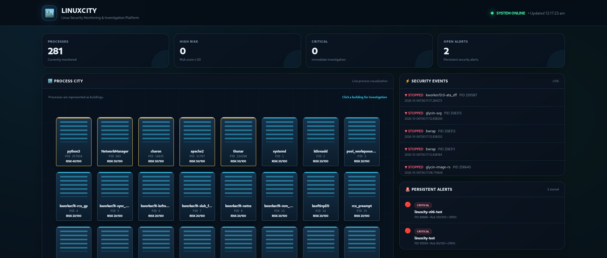
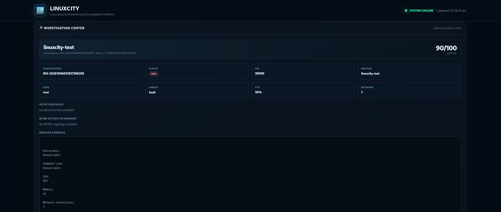
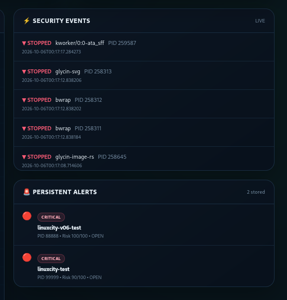

# 🏙️ LinuxCity

### Lightweight Linux Endpoint Detection & Response Platform

<p align="center">

**Monitor → Detect → Score → Alert → Investigate**

</p>

<p align="center">


</p>

---

## 🎯 What is LinuxCity?

**LinuxCity** is a lightweight Linux security monitoring and investigation platform that transforms running Linux processes into a **security-observable environment**.

It continuously collects process telemetry, evaluates explainable behavioral risk, applies detection rules, maps detections to **MITRE ATT&CK**, generates persistent alerts, and provides an analyst-oriented SOC dashboard for investigation.

The project is designed to demonstrate practical concepts used in:

* 🛡️ Security Operations Centers
* 🔎 Endpoint Detection & Response
* 🚨 Threat Detection
* 📊 Security Monitoring
* 🧩 Detection Engineering
* 🔬 Incident Investigation
* 🗺️ MITRE ATT&CK analysis

---

# 🖥️ LinuxCity in Action

## SOC Dashboard



The SOC dashboard provides a real-time view of running processes, risk levels, security events, and persistent alerts.

---

## 🔎 Process Investigation



The Investigation Center brings together process evidence, risk information, detection rules, and MITRE ATT&CK context for analyst investigation.

---

## 🚨 Security Events



Persistent alerts provide severity, risk score, process information, detection context, and investigation data.

---

# 🧠 Security Monitoring Pipeline

```text
┌─────────────────────┐
│     Linux Host      │
└──────────┬──────────┘
           │
           ▼
┌─────────────────────┐
│   Process Monitor   │
│                     │
│ PID / PPID          │
│ User                │
│ Process              │
│ CPU / Memory        │
│ Process Events      │
└──────────┬──────────┘
           │
           ▼
┌─────────────────────┐
│   Security Engine   │
│                     │
│ Risk Calculation    │
│ Behavioral Signals  │
│ Explainable Reasons │
└──────────┬──────────┘
           │
           ▼
┌─────────────────────┐
│  Detection Engine   │
│                     │
│ Detection Rules     │
│ MITRE ATT&CK        │
│ Severity             │
└──────────┬──────────┘
           │
           ▼
┌─────────────────────┐
│    Alert Engine     │
│                     │
│ Persistent Alerts   │
│ Deduplication       │
│ Evidence             │
└──────────┬──────────┘
           │
           ▼
┌─────────────────────┐
│ Investigation Engine│
│                     │
│ Evidence             │
│ Detections           │
│ MITRE Techniques     │
│ Analyst Notes        │
└──────────┬──────────┘
           │
           ▼
┌─────────────────────┐
│    SOC Dashboard    │
│                     │
│ Monitor             │
│ Investigate         │
│ Analyze             │
└─────────────────────┘
```

---

# 🔥 Core Capabilities

| Capability              | Description                                            |
| ----------------------- | ------------------------------------------------------ |
| 🖥️ Process Monitoring  | Continuously observes running Linux processes          |
| 🌳 Process Visibility   | Tracks PID, PPID, parent process and execution context |
| 📈 Resource Monitoring  | Monitors CPU and memory utilization                    |
| 🔄 Lifecycle Detection  | Detects process start and stop events                  |
| ⚠️ Risk Scoring         | Calculates explainable 0–100 security risk             |
| 🔍 Behavioral Detection | Evaluates process behavior against detection rules     |
| 🚨 Persistent Alerting  | Stores security alerts for later investigation         |
| 🧹 Alert Deduplication  | Prevents repeated identical open alerts                |
| 🗺️ MITRE Mapping       | Associates detection signals with ATT&CK techniques    |
| 🔬 Investigation Center | Provides evidence-driven investigation context         |
| 🏙️ SOC Dashboard       | Web interface for security monitoring                  |
| 🔌 REST APIs            | Exposes process, alert, city and investigation data    |
| 🔒 Local Security       | Dashboard binds to localhost by default                |
| ⚙️ CI                   | Automated testing through GitHub Actions               |

---

# 🛡️ Detection Engineering

LinuxCity currently implements five detection rules.

| Rule      | Detection                      | Severity | MITRE ATT&CK |
| --------- | ------------------------------ | -------- | ------------ |
| `LC-R001` | Root Process Execution         | Medium   | T1078        |
| `LC-R002` | Suspicious Temporary Execution | High     | T1204        |
| `LC-R003` | Shell Spawned Process          | Medium   | T1059        |
| `LC-R004` | High Resource Utilization      | High     | T1496        |
| `LC-R005` | Network Active Process         | Medium   | T1071        |

### Detection Philosophy

LinuxCity uses multiple observable signals rather than treating a single property as proof of compromise.

Examples include:

```text
Root execution
      +
Suspicious executable location
      +
Shell parent
      +
High CPU
      +
Network activity
      ↓
Higher contextual risk
```

The detections are intentionally **explainable** so an analyst can understand why an alert was generated.

> **Important:** These rules are behavioral indicators and contextual ATT&CK mappings. A detection or high risk score does not by itself prove malicious activity.

---

# 📊 Explainable Risk Scoring

LinuxCity calculates a risk score from **0–100**.

| Signal                                         | Score |
| ---------------------------------------------- | ----: |
| Process running as root                        |   +20 |
| Executable from `/tmp`, `/var/tmp`, `/dev/shm` |   +30 |
| CPU ≥ 80%                                      |   +20 |
| Active network connections                     |   +10 |
| Parent process is `bash`, `sh`, or `zsh`       |   +10 |

Maximum score:

```text
100
```

Severity is derived from the resulting score:

|  Score | Severity    |
| -----: | ----------- |
|   0–24 | 🟢 LOW      |
|  25–49 | 🟡 MEDIUM   |
|  50–74 | 🟠 HIGH     |
| 75–100 | 🔴 CRITICAL |

Every score is accompanied by **human-readable reasons**, allowing an analyst to understand the detection rather than receiving an unexplained numerical value.

---

# 🗺️ MITRE ATT&CK Context

LinuxCity provides contextual ATT&CK mappings for its detection signals.

Examples include:

```text
T1078  → Valid Accounts
T1204  → User Execution
T1059  → Command and Scripting Interpreter
T1496  → Resource Hijacking
T1071  → Application Layer Protocol
```

The mappings are used to provide **investigation context**, not to claim that a technique has been conclusively performed.

---

# 🚨 Alert & Investigation Workflow

LinuxCity follows a simplified SOC investigation workflow:

```text
┌──────────┐
│ Process  │
│ Activity │
└────┬─────┘
     │
     ▼
┌──────────┐
│Detection │
└────┬─────┘
     │
     ▼
┌──────────┐
│   Risk   │
│  Score   │
└────┬─────┘
     │
     ▼
┌──────────┐
│  Alert   │
└────┬─────┘
     │
     ▼
┌──────────────┐
│ Investigation│
└──────┬───────┘
       │
       ▼
┌──────────────┐
│   Evidence   │
│      +       │
│ MITRE Context│
└──────────────┘
```

Each persistent alert can contain:

* Alert ID
* Timestamp
* PID
* Process name
* Username
* Parent process
* Executable path
* Command line
* CPU usage
* Memory usage
* Network connections
* Risk score
* Severity
* Detection rules
* MITRE ATT&CK context
* Investigation information

---

# 🔬 Investigation Center

For an alert, LinuxCity builds an investigation object containing:

### Process Evidence

```text
PID
Process name
Username
Parent process
Executable
Command line
```

### Resource Evidence

```text
CPU utilization
Memory utilization
Network connection count
```

### Detection Evidence

```text
Rule ID
Detection name
Severity
Reason
```

### MITRE Context

```text
Technique ID
Technique name
Associated detection rule
```

This creates a single analyst-oriented view instead of requiring the analyst to manually reconstruct the alert from separate data sources.

---

# 🌐 Local SOC API

LinuxCity exposes a small Flask API for the dashboard and investigation workflow.

| Endpoint                             | Purpose                         |
| ------------------------------------ | ------------------------------- |
| `GET /`                              | SOC dashboard                   |
| `GET /api/processes`                 | Current process telemetry       |
| `GET /api/city`                      | Process city, events and alerts |
| `GET /api/alerts`                    | Persistent alerts               |
| `GET /api/investigations/<alert_id>` | Investigation data              |

Default dashboard:

```text
http://127.0.0.1:5000
```

The application binds to **localhost by default** rather than exposing the dashboard to the network.

---

# 🧱 Project Architecture

```text
LinuxCity/
│
├── .github/
│   └── workflows/
│       └── ci.yml
│
├── data/
│   └── alerts.json
│
├── docs/
│   ├── architecture.md
│   ├── detection-rules.md
│   └── investigation.md
│
├── screenshots/
│   ├── Dashboard.png
│   ├── Investigation-Centre.png
│   └── Security-Events.png
│
├── src/
│   ├── alert_engine.py
│   ├── dashboard.py
│   ├── detection_engine.py
│   ├── investigation_engine.py
│   ├── main.py
│   ├── process_monitor.py
│   ├── security_engine.py
│   ├── __init__.py
│   └── templates/
│       └── dashboard.html
│
├── tests/
│   ├── test_alert_engine.py
│   ├── test_detection_engine.py
│   ├── test_investigation_engine.py
│   ├── test_process_monitor.py
│   └── test_security_engine.py
│
├── .gitignore
├── CHANGELOG.md
├── README.md
├── SECURITY.md
└── requirements.txt
```

---

# ⚙️ Technology Stack

### Core

* **Python**
* **Flask**
* **psutil**
* **JSON**

### Security

* Process telemetry
* Behavioral detection
* Risk scoring
* MITRE ATT&CK
* Alert management
* Security investigation

### Engineering

* Pytest
* Git
* GitHub Actions
* REST APIs
* HTML/CSS/JavaScript

---

# 🚀 Quick Start

## 1. Clone

```bash
git clone https://github.com/re-enter-sys/LinuxCity.git
cd LinuxCity
```

## 2. Create virtual environment

```bash
python3 -m venv .venv
source .venv/bin/activate
```

## 3. Install dependencies

```bash
pip install -r requirements.txt
```

## 4. Start LinuxCity

```bash
PYTHONPATH=src python3 src/dashboard.py
```

Open:

```text
http://127.0.0.1:5000
```

---

# 🧪 Testing

LinuxCity includes automated tests covering:

* Process monitoring
* Process events
* Security engine
* Risk scoring
* Detection rules
* Alert creation
* Alert deduplication
* Investigation generation

Run the test suite:

```bash
PYTHONPATH=src pytest -v
```

GitHub Actions also runs the test suite automatically for supported pushes and pull requests.

---

# 🔐 Security Considerations

LinuxCity is intended for **local security monitoring, learning, defensive research, and authorized environments**.

Important considerations:

* The dashboard is bound to `127.0.0.1` by default.
* Some process information requires elevated privileges.
* Security heuristics can produce false positives.
* A high risk score does not prove compromise.
* MITRE ATT&CK mappings provide contextual classification.
* The current alert store uses JSON rather than a production database.
* LinuxCity should not be treated as a replacement for a mature enterprise EDR.

See [`SECURITY.md`](SECURITY.md) for additional information.

---

# ⚠️ Current Limitations

LinuxCity is intentionally lightweight.

Current limitations include:

* JSON-based alert persistence
* Local-only dashboard
* No authentication/RBAC
* Limited network metadata
* No file hashing pipeline
* No YARA integration
* No centralized SIEM integration
* Heuristic rather than ML-based behavioral detection
* No automated remediation

These limitations provide a clear path for future development.

---

# 🛣️ Roadmap

Potential future improvements include:

```text
[ ] SQLite event database
[ ] Alert lifecycle management
[ ] Process start-time tracking
[ ] File hash collection
[ ] Network destination analysis
[ ] DNS visibility
[ ] Authentication monitoring
[ ] YARA integration
[ ] SIEM/syslog integration
[ ] Detection correlation
[ ] Analyst authentication
[ ] RBAC
[ ] Docker deployment
[ ] Systemd service
[ ] Automated response actions
```

---

# 🎓 Security Concepts Demonstrated

LinuxCity demonstrates practical knowledge of:

* Linux process architecture
* Endpoint telemetry
* Security monitoring
* Detection engineering
* Behavioral indicators
* Risk-based alerting
* Alert deduplication
* Incident investigation
* MITRE ATT&CK
* SOC workflows
* REST API development
* Security dashboard development
* Defensive automation
* Python security tooling
* CI/CD for security projects

---

# 💼 SOC Analyst Use Case

A simplified analyst workflow using LinuxCity:

```text
1. MONITOR
   ↓
   Observe Linux process activity

2. DETECT
   ↓
   Identify suspicious behavioral signals

3. SCORE
   ↓
   Calculate contextual risk

4. ALERT
   ↓
   Generate and persist an alert

5. INVESTIGATE
   ↓
   Examine process and execution evidence

6. CLASSIFY
   ↓
   Review detection and MITRE context

7. DOCUMENT
   ↓
   Record investigation findings
```

This workflow mirrors the fundamental **monitor → detect → investigate → classify** process used in security operations.

---

# 📚 Documentation

Additional project documentation:

* [`Architecture`](docs/architecture.md)
* [`Detection Rules`](docs/detection-rules.md)
* [`Investigation Workflow`](docs/investigation.md)
* [`Security Policy`](SECURITY.md)
* [`Changelog`](CHANGELOG.md)

---

# ⭐ Why LinuxCity?

LinuxCity was built as a practical cybersecurity engineering project rather than a simple monitoring script.

The project combines:

```text
Linux Internals
      +
Python Engineering
      +
Security Detection
      +
Risk Analysis
      +
MITRE ATT&CK
      +
Alert Management
      +
Investigation
      +
SOC Visualization
```

The goal is to demonstrate how raw endpoint telemetry can be transformed into **actionable security information for an analyst**.

---

# 👨‍💻 Author

**Ch Viswa**

Computer Science Graduate | Cybersecurity / SOC Analyst

Focused on:

**SOC Operations • Threat Detection • Incident Investigation • Blue Team Security • Detection Engineering**

---

<p align="center">

### 🏙️ LinuxCity

**Turning Linux process activity into security intelligence.**

</p>
